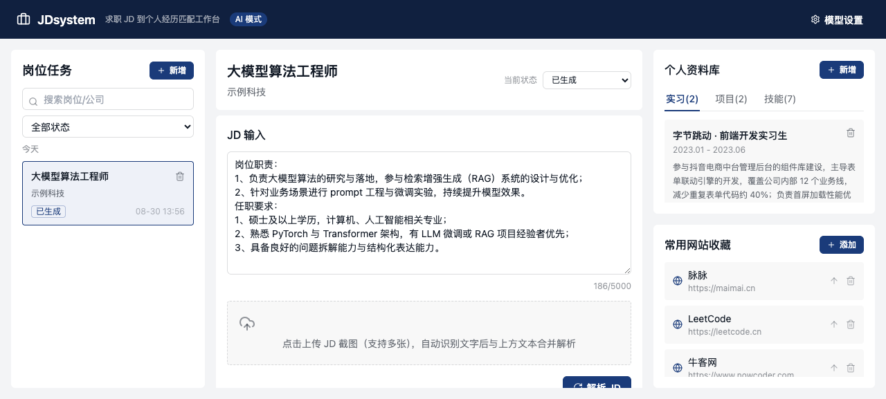
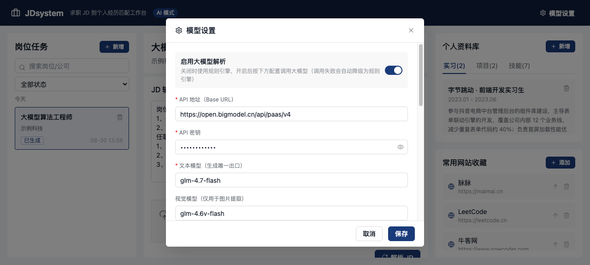

# 🎯 JDSystem · 让每份简历都"对得上"岗位

> **产品定位**：面向求职者的「JD 岗位需求 → 个人经历 → 定向简历」智能匹配与改写工作台。
> **核心价值**：把用户的真实经历，以可溯源的方式，改写成一封定向匹配岗位的简历——**每句话都查得到出处，绝不替用户编造。**

📌 这是一个防编造的简历定向改写工具，从用户洞察、流程设计、方法论沉淀到前端落地形成完整闭环。

---

## ✨ 它解决什么痛点？

简历投递转化率低，往往不是求职者不够优秀，而是**简历没有"对上"岗位**。

| 😣 典型痛点 | 💡 产品解法 |
| --- | --- |
| 不知道简历哪里弱、成果不会量化 | 解析 JD → 拆出「岗位到底要什么」的需求清单 |
| 一份简历投所有岗位，泛泛而谈 | 按 JD 量身匹配用户的真实经历证据 |
| 怕 AI 改写失真、千篇一律、甚至编造经历 | **每句可溯源、夸大主动标红、悬空记录自动拦截** |
| 同一段经历反复重写，越改越乱 | 历史版本继承 + 任务状态机管理投递节奏 |

> 设计原则：**可信度优先于完成度**。宁可不写，也不编——这才是用户敢拿去投递的真简历。

---

## 🚀 三步上手

```bash
npm install
npm run dev      # 打开 http://localhost:5173 即可使用
npm run build    # 打包出 dist/，可部署到任意静态服务器
```

不填任何 Key 也能用 ✅ —— 内置免费规则引擎，核心功能完整可跑。启用大模型只需在右上角「模型设置」填写。

---

## 🔄 核心工作流（一个闭环）

不是功能堆砌，而是一条**从 JD 解析到投递管理**的完整链路：

```
📋 输入 JD（粘贴 / 截图识别）
   ↓
🧠 JD 智能解析（四层拆解 + 方向判断 + 负向筛选）
   ↓
🎯 经历匹配打分（核心动作 40% / 结果证据 30% / 场景 20% / 工具 10%）
   ↓
✍️ 定向生成（实习 / 项目，STAR 版）
   ↓
🔍 句子级溯源 + 夸大风险标红 → 用户确认
   ↓
💾 存版本 / 更状态 / 去投递
```

**1️⃣ 输入 JD**：直接粘贴，或上传多张招聘截图——自动识别合并为文字。
**2️⃣ JD 四层拆解**：`核心动作 → 所需能力 → 证据类型 → 提取提示`，并做方向判断与「反向排除」（JD 明确不要的也一并记录）。
**3️⃣ 经历匹配**：按权重打分，给出强 / 部分 / 弱匹配三级（实习优先承接职责，项目优先承接加分项）。
**4️⃣ 定向生成**：实习 / 项目内容生成，支持「简历版 / STAR 版」；经历多于 3 条时取最优 2–3 条，并说明未选中原因。
**5️⃣ 质量控制**：每句标注来源、夸大主动标红，交回用户拍板。
**6️⃣ 沉淀**：历史版本可继承、任务状态可追踪。

---

## 🧰 功能清单

| 功能 | 说明 |
| --- | --- |
| 🖼️ 多模态输入 | 粘贴 JD 文本；多张截图上传自动识别合并；有图先视觉转文字 |
| 🧠 JD 智能解析 | 按 8 条方法论核心规则拆解 JD，严格 JSON 输出 |
| 🎯 经历匹配 | 打分分级（强 / 部分 / 弱 / 无证据） |
| ✍️ 内容生成 | 实习 / 项目生成；经历 ≤3 条全保留，>3 条取最优并给未推荐原因 |
| 🛡️ 防编造质控 | 句子级溯源、夸大标红、未用片段 = 主动省略 |
| 🕑 历史版本 | 跨次生成继承旧版，回退前自动备份当前编辑 |
| 📊 任务状态机 | 岗位列表搜索 / 筛选 / 按日期分组；7 态状态机 |
| 🗂️ 个人资料库 | 实习 / 项目 / 技能标签 + 常用网站收藏 |
| 🔁 双轨模式 | AI 模式（大模型）与免费规则模式可一键切换 |

---

## 🤖 大模型架构（如何做到"看懂"又"不乱编"）

系统采用「**多模态输入归一化 → 单一文本模型出口**」的四模块结构，职责清晰分离：

| 模块 | 文件 | 职责 |
| --- | --- | --- |
| ① Config | `types.ts` / 设置 UI | 管 Key、Base URL、模型名、可编辑 Prompt 模板 |
| ② InputRouter | `inputRouter.ts` | 有图先转文字再合并，无图直接透传 |
| ③ VisionExtractor | `visionExtractor.ts` | 视觉模型**只负责"看懂"**，把图转文字，不做任何生成 |
| ④ TextGenerator | `provider.ts` | **唯一生成出口**：解析 / 匹配 / 生成全走它 |

四个 LLM 节点（每个严格 JSON + 版本号）：`jd_analysis` / `jd_matching` / `internship_generation` / `project_generation`。

> 💡 设计权衡：视觉模型只"看"，文本模型只"写"。最终输出只受一个模型、一套协议约束，避免多模型各说各话导致的失真。

关键约定：
- 🔌 **失败自动降级**：关闭大模型或遇到 429 限流，自动切回内置规则引擎，并用横幅提示「这部分由规则生成」。
- 🖼️ **图片不落库**：截图只在本地转成文字后即丢弃，不占存储、不泄露。
- ⚙️ **多套配置**：默认智谱，用户也可自存命名配置，下拉一键切换。

---

## 🛡️ 防编造机制（产品的核心差异化）

简历工具最大的隐患是：**AI 替用户编了段根本没发生过的事**。JDSystem 从三个层面约束：

- 🔗 **句子级事实溯源** `sentenceEvidenceMap`：每句话标 `事实支撑 / 合理改写 / 需确认` 三级，并指向来源经历。
- 🚩 **夸大风险标记** `riskFlags`：识别"可能吹过头"的表述，主动标给用户。
- 🫥 **未使用片段 = 主动省略** `usedFactFragments`：明示哪些证据未被采用，不藏不掩。
- 🚫 **防悬空记录** `hydrateGenerationResult`：对模型返回的 `sourceExperienceId` 做真实性校验，杜绝指向不存在的经历。

---

## 📸 示例截图

| 🖥️ 工作台总览 | ⚙️ 模型设置 |
| --- | --- |
|  |  |


---

## 💾 数据存储

- 业务数据存于浏览器 `localStorage`，**无后端依赖、纯前端可跑**。
- 首次打开自动写入示例数据（2 段实习 + 2 个项目 + 7 项技能、5 个常用站点），开箱即用。
- 清除浏览器存储会丢失数据；规模化使用建议接入后端做持久化（见 Roadmap）。

---

## 📊 任务状态管理

投递节奏可视化：状态机 `待生成 → 已生成 → 待投递 → 已投递 → 面试中 → offer / 拒信`，任务列表支持搜索 / 筛选 / 按日期分组。

---

## 🧱 技术栈

- ⚛️ React 18.3.1 / TypeScript 5.9.3 / Vite 5.4.11
- 🎨 自研 UI 组件层 `src/vendor/mtd-react3`
- 🗄️ localStorage 数据层 `src/lib/db.ts`
- 🧹 Prettier 3.6.2 / ESLint 9.39.1

<details>
<summary>📂 点击展开项目结构</summary>

```text
src/
├── components/workbench/  # 工作台各面板（含 SourceBanner 降级提示）
├── lib/
│   ├── db.ts              # 数据访问层（localStorage）
│   ├── jdParser.ts        # 图片识别 / 链接抓取
│   ├── llm/
│   │   ├── provider.ts    # 大模型调度 + 规则引擎降级 + 防悬空校验
│   │   ├── inputRouter.ts # 多模态输入归一化
│   │   ├── visionExtractor.ts
│   │   ├── promptSchemas.ts
│   │   └── ruleEngine.ts  # 免费规则引擎
│   └── seedData.ts
├── styles/tokens.css      # 设计 Token
├── vendor/mtd-react3/     # UI 组件层
├── types.ts               # 全局类型（状态机 / 溯源枚举）
├── App.tsx
└── main.tsx
```

</details>

---

## ⚠️ 已知限制

- 🔗 不再支持「职位链接一键抓取」：原方案依赖内网代理，浏览器直连又受 CORS 与反爬限制，可用性差，已移除。推荐文本粘贴或截图上传。
- 🔑 API Key 存于浏览器 `localStorage` 并前端直连模型服务，会暴露在前端，**仅建议自用场景**。

---

## 🗺️ 产品化路径与商业判断（规划中，非当前已实现）

从产品演进角度，后续可拓展的方向：

- 💎 **C 端 freemium**：免费诊断引流 + 付费深度优化 / 订阅；
- 🤝 **B2B2C**：面向就业中心 / 培训机构 / 猎头的机构版；
- 📈 **数据护城河**：面试邀约率埋点追踪，用真实转化数据反哺匹配模型。
